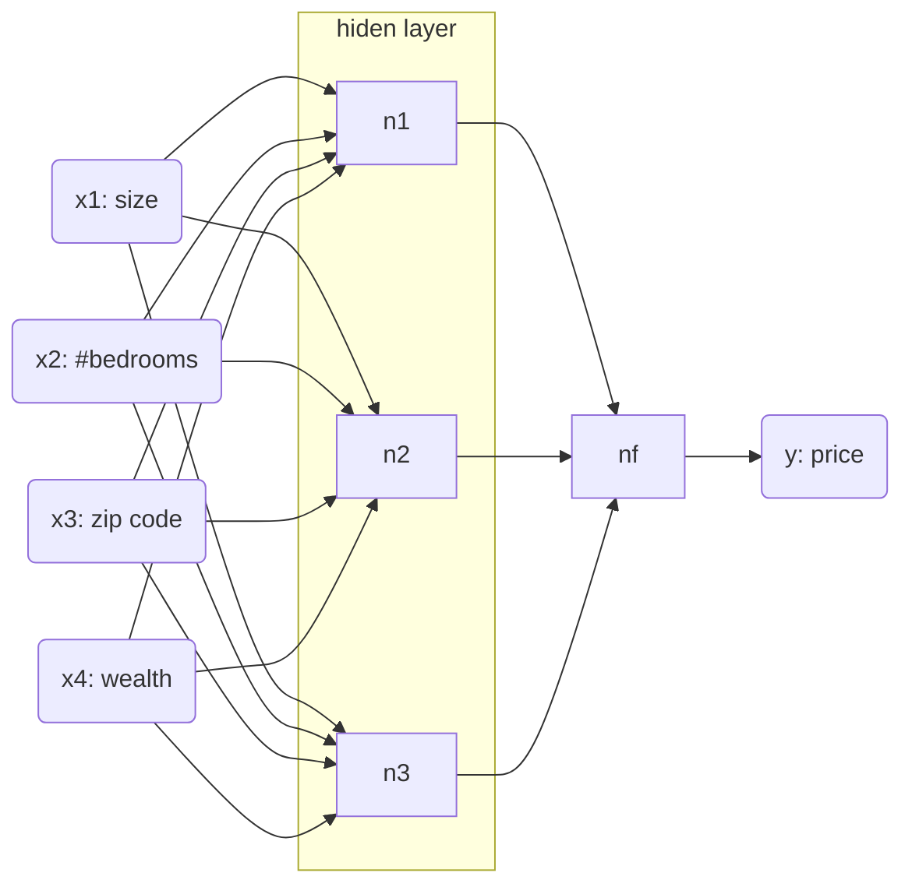

# Week 1

## what is NN?

- E.g. housing price prediction
    - features to predict the price
    - RELU

An NN is statistics tool or framework to predict y using x.

## Supervised learning with NN

1. applications
    - real estate (x: home feats.; y: price)
    - onlinde advertising (x: ad, user info; y: click on ad? 0/1)
    - photo tagging (x: image; y: object(1,...,1000))
    - speech recognition (x: audio; y: text transcript)
    - translation (x: english; y:chinese)
    - autonomous driving (x: image, radar; y: postion)
1. architecture
    - nn
    - cnn
    - rnn
1. data
    - structured data (tabular data)
    - unstructured data (audio, images, text)

## Why deep learning taking off

- traditional techniques requires small amount of data to achieve the better performance
- small nn requires small amount of data to achieve the better performance
- mid  nn requires medium amount of data to achieve the better perfomance
- big nn requires big amount of data to achieve the better performance
- feat engineering important with small amount of data in all NN
- progress focused on
    - data
    - computation (better performance) [gpu]
    - algorithms (better performance) [sigmoid, relu]
    - research cycle
        - idea -> code -> experiment (10 mins, 1 day, 1 month)
